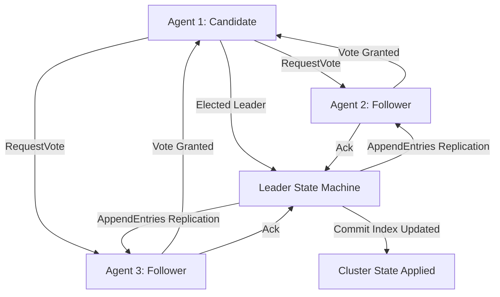

# GenPark Raft Distributed Consensus State Machine Skill

GenPark standard library Raft distributed consensus protocol engine for coordinating agent swarms.

For comprehensive architectural blueprints, visit [GenPark](https://genpark.ai) and explore the [GenPark MCP Directory](https://genpark.ai/mcp).

## Features
- Complete pure Python stdlib implementation of Raft (Leader Election, Log Replication, Heartbeat synchronization).
- Zero external dependencies.
- Tested and verified on Windows, macOS, and Linux.
